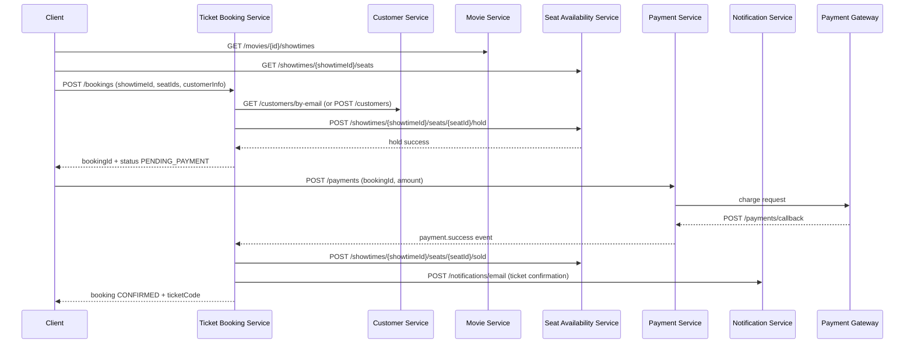
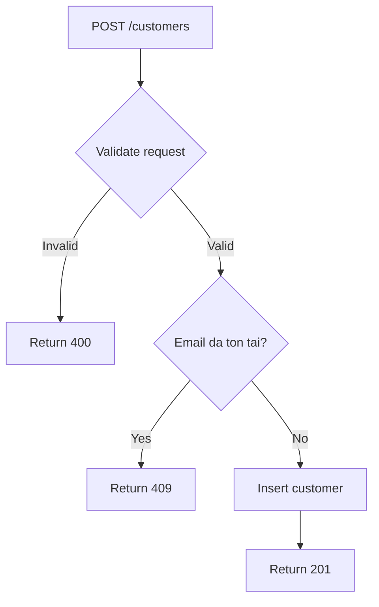
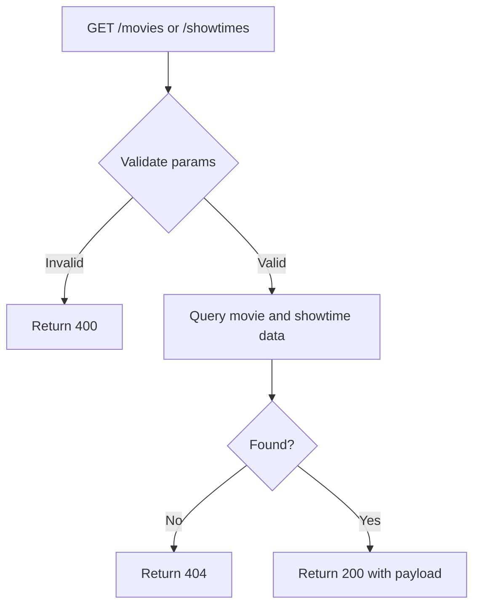
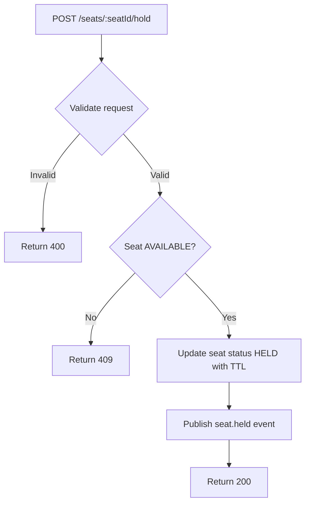
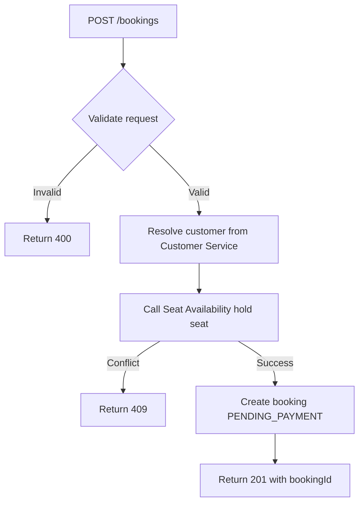
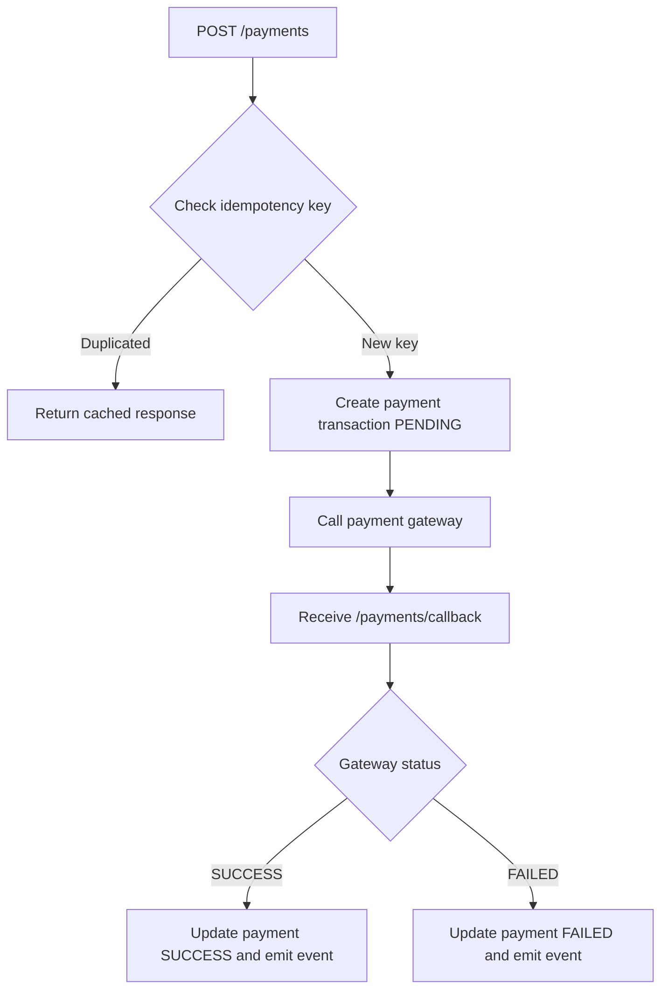
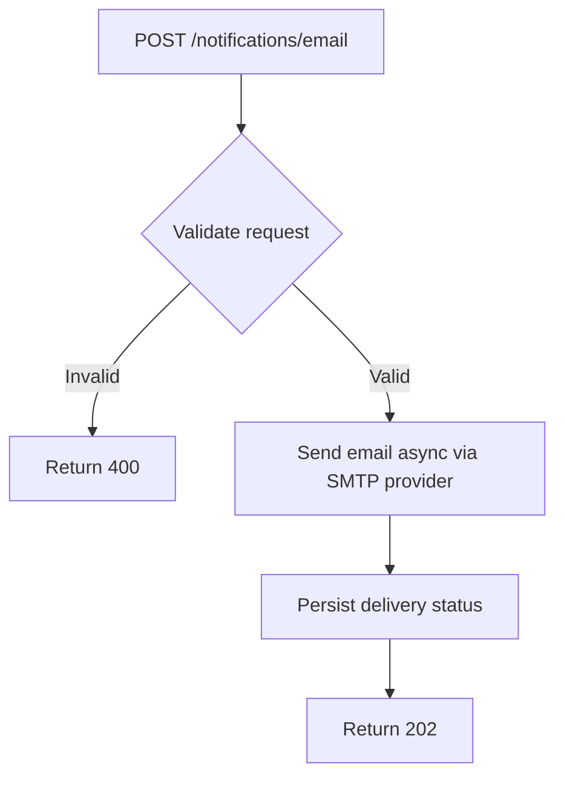

# Analysis and Design — Hệ Thống Đặt Vé Xem Phim Trực Tuyến

> **Goal**: Analyze a specific business process and design a service-oriented automation solution (SOA/Microservices).
> Scope: Focus on **one business process**, not an entire system.

**References:**
1. *Service-Oriented Architecture: Analysis and Design for Services and Microservices* — Thomas Erl (2nd Edition)
2. *Microservices Patterns: With Examples in Java* — Chris Richardson
3. *Bài tập — Phát triển phần mềm hướng dịch vụ* — Hung Dang (available in Vietnamese)

---

## Part 1 — Analysis Preparation

### 1.1 Business Process Definition

Describe or diagram the high-level Business Process to be automated.

- **Domain**: Giải trí - Đặt vé xem phim trực tuyến
- **Business Process**: Đặt vé xem phim trực tuyến từ chọn phim/lịch chiếu, chọn ghế, xác nhận đặt vé, thanh toán, đến nhận vé điện tử qua email.
- **Actors**: Khách hàng, Cổng thanh toán (hệ thống bên ngoài), Nhân viên rạp (quản trị nội dung phim/lịch chiếu).
- **Scope**: Một giao dịch đặt vé cho một phiên người dùng, bao gồm các luồng thành công, thất bại thanh toán, hủy giao dịch, và hết thời gian giữ ghế.

**Process Diagram:**

### 1.2 Existing Automation Systems

List existing systems, databases, or legacy logic related to this process.

| System Name | Type | Current Role | Interaction Method |
|-------------|------|--------------|-------------------|
| Không có | - | Hệ thống triển khai mới (greenfield) | - |

> If none exist, state: *"None — the process is currently performed manually."*

### 1.3 Non-Functional Requirements

Non-functional requirements serve as input for identifying Utility Service and Microservice Candidates in step 2.7.

| Requirement    | Description |
|----------------|-------------|
| Performance    | API đồng bộ nội bộ phản hồi mục tiêu < 300ms (không tính độ trễ từ cổng thanh toán bên ngoài). |
| Security       | Validate dữ liệu ở mọi endpoint; sử dụng idempotency key cho API tạo booking và thanh toán; không lưu thông tin thẻ nhạy cảm. |
| Scalability    | Hỗ trợ tối thiểu 1,000 request đồng thời trong giờ cao điểm; cho phép scale ngang từng service bằng container. |
| Availability   | Mục tiêu 99.9% uptime; service tự phục hồi sau restart; không có single point of failure ở tầng message broker và database. |

---

## Part 2 — REST/Microservices Modeling

### 2.1 Decompose Business Process & 2.2 Filter Unsuitable Actions

Decompose the process from 1.1 into granular actions. Mark actions unsuitable for service encapsulation.

| # | Action | Actor | Description | Suitable? |
|---|--------|-------|-------------|-----------|
| 1 | Tải danh sách phim đang chiếu/sắp chiếu | Hệ thống | Lấy dữ liệu phim từ Movie Service | ✅ |
| 2 | Hiển thị danh sách phim | Giao diện client | Render thông tin phim | ❌ |
| 3 | Người dùng chọn phim | Người dùng | Chọn phim muốn xem | ❌ |
| 4 | Tải danh sách rạp và lịch chiếu | Hệ thống | Lấy suất chiếu theo phim/rạp | ✅ |
| 5 | Người dùng chọn suất chiếu | Người dùng | Chọn rạp, giờ chiếu | ❌ |
| 6 | Tải sơ đồ ghế theo suất chiếu | Hệ thống | Lấy trạng thái ghế từ Seat Availability Service | ✅ |
| 7 | Người dùng chọn ghế | Người dùng | Click ghế trên UI | ❌ |
| 8 | Kiểm tra ghế còn trống | Hệ thống | Xác thực ghế đang AVAILABLE | ✅ |
| 9 | Giữ ghế tạm thời | Hệ thống | Đánh dấu ghế HELD theo TTL | ✅ |
| 10 | Người dùng nhập thông tin liên hệ | Người dùng | Nhập email/số điện thoại | ❌ |
| 11 | Tạo yêu cầu đặt vé | Hệ thống | Ticket Booking Service tạo booking PENDING | ✅ |
| 12 | Liên kết khách hàng với booking | Hệ thống | Lấy/tạo customer profile trong Customer Service | ✅ |
| 13 | Khởi tạo thanh toán | Hệ thống | Payment Service tạo payment transaction | ✅ |
| 14 | Chuyển hướng đến cổng thanh toán | Hệ thống | Gửi yêu cầu charge đến gateway | ✅ |
| 15 | Nhận callback kết quả thanh toán | Hệ thống | Gateway gọi webhook kết quả | ✅ |
| 16 | Đánh dấu đặt vé thành công | Hệ thống | Cập nhật booking CONFIRMED | ✅ |
| 17 | Đánh dấu ghế đã bán | Hệ thống | Seat Availability Service chuyển SOLD | ✅ |
| 18 | Tạo mã vé điện tử | Hệ thống | Sinh ticket code/QR | ✅ |
| 19 | Gửi email xác nhận vé | Hệ thống | Notification Service gửi email | ✅ |
| 20 | Xử lý thanh toán thất bại/hết giờ | Hệ thống | Booking FAILED, release ghế | ✅ |

> Actions marked ❌: manual-only, require human judgment, or cannot be encapsulated as a service.

### 2.3 Entity Service Candidates

Identify business entities and group reusable (agnostic) actions into Entity Service Candidates.

| Entity | Service Candidate | Agnostic Actions |
|--------|-------------------|------------------|
| Customer | Customer Service | Tạo hồ sơ khách hàng, cập nhật thông tin, tra cứu khách hàng theo email/số điện thoại, lấy lịch sử booking của khách hàng |
| Movie, Theater, Showtime | Movie Service | Quản lý thông tin phim, rạp, phòng chiếu, lịch chiếu; truy vấn danh sách phim/lịch chiếu |
| SeatInventory, SeatHold | Seat Availability Service | Kiểm tra trạng thái ghế, giữ ghế theo TTL, mở ghế, đánh dấu ghế SOLD |
| Booking, Ticket | Ticket Booking Service | Tạo booking, cập nhật trạng thái booking, sinh ticket code, truy vấn chi tiết vé |
| PaymentTransaction | Payment Service | Tạo giao dịch thanh toán, xử lý callback, cập nhật trạng thái payment |
| NotificationMessage | Notification Service | Gửi email xác nhận/thất bại, ghi nhận lịch sử gửi thông báo |

### 2.4 Task Service Candidate

Group process-specific (non-agnostic) actions into a Task Service Candidate.

| Non-agnostic Action | Task Service Candidate |
|---------------------|------------------------|
| Điều phối toàn bộ luồng đặt vé: kiểm tra ghế -> giữ ghế -> tạo booking -> gọi thanh toán -> xác nhận vé | Ticket Booking Service |
| Quyết định business rule khi ghế không khả dụng hoặc giữ ghế hết hạn | Ticket Booking Service |
| Quyết định hành vi hậu thanh toán: thành công thì phát hành vé, thất bại thì release ghế | Ticket Booking Service |

### 2.5 Identify Resources

Map entities/processes to REST URI Resources.

| Entity / Process | Resource URI |
|------------------|--------------|
| Quản lý khách hàng | `POST /customers`, `GET /customers/{id}`, `GET /customers/by-email` |
| Danh sách phim | `GET /movies` |
| Chi tiết phim | `GET /movies/{id}` |
| Lịch chiếu theo phim | `GET /movies/{id}/showtimes` |
| Kiểm tra sơ đồ ghế | `GET /showtimes/{showtimeId}/seats` |
| Giữ ghế | `POST /showtimes/{showtimeId}/seats/{seatId}/hold` |
| Mở ghế | `POST /showtimes/{showtimeId}/seats/{seatId}/release` |
| Tạo booking | `POST /bookings` |
| Lấy booking | `GET /bookings/{id}` |
| Thanh toán booking | `POST /payments` |
| Callback thanh toán | `POST /payments/callback` |
| Gửi email thông báo | `POST /notifications/email` |

### 2.6 Associate Capabilities with Resources and Methods

| Service Candidate | Capability | Resource | HTTP Method |
|-------------------|------------|----------|-------------|
| Customer Service | Tạo khách hàng | `/customers` | POST |
| Customer Service | Lấy thông tin khách hàng | `/customers/{id}` | GET |
| Customer Service | Tìm khách hàng theo email | `/customers/by-email` | GET |
| Movie Service | Lấy danh sách phim | `/movies` | GET |
| Movie Service | Lấy chi tiết phim | `/movies/{id}` | GET |
| Movie Service | Lấy lịch chiếu theo phim | `/movies/{id}/showtimes` | GET |
| Seat Availability Service | Lấy trạng thái ghế theo suất chiếu | `/showtimes/{showtimeId}/seats` | GET |
| Seat Availability Service | Giữ ghế tạm thời | `/showtimes/{showtimeId}/seats/{seatId}/hold` | POST |
| Seat Availability Service | Mở lại ghế | `/showtimes/{showtimeId}/seats/{seatId}/release` | POST |
| Seat Availability Service | Đánh dấu ghế đã bán | `/showtimes/{showtimeId}/seats/{seatId}/sold` | POST |
| Ticket Booking Service | Tạo booking | `/bookings` | POST |
| Ticket Booking Service | Lấy chi tiết booking | `/bookings/{id}` | GET |
| Ticket Booking Service | Hủy booking | `/bookings/{id}/cancel` | POST |
| Payment Service | Khởi tạo thanh toán | `/payments` | POST |
| Payment Service | Nhận callback thanh toán | `/payments/callback` | POST |
| Notification Service | Gửi email thông báo | `/notifications/email` | POST |

### 2.7 Utility Service & Microservice Candidates

Based on Non-Functional Requirements (1.3) and Processing Requirements, identify cross-cutting utility logic or logic requiring high autonomy/performance.

| Candidate | Type (Utility / Microservice) | Justification |
|-----------|-------------------------------|---------------|
| API Gateway | Utility Service | Routing, rate limiting, authn/authz, correlation-id cho toàn hệ thống. |
| Redis Cache | Utility Service | Cache danh sách phim/lịch chiếu và lưu idempotency key cho booking/payment. |
| RabbitMQ + Outbox Pattern | Utility Service | Đảm bảo truyền event không mất dữ liệu giữa Booking, Seat, Payment và Notification. |
| Seat Availability Service | Microservice | Thành phần có tần suất truy cập cao nhất, cần tối ưu concurrency và lock ghế độc lập. |
| Payment Service | Microservice | Tích hợp bên thứ ba, có rủi ro lỗi riêng, cần triển khai và scale tách biệt để cô lập sự cố. |

### 2.8 Service Composition Candidates

Interaction diagram showing how Service Candidates collaborate to fulfill the business process.

---

## Part 3 — Service-Oriented Design

> Part 3 is the **convergence point** — regardless of whether you used Step-by-Step Action or DDD in Part 2, the outputs here are the same: service contracts and service logic.

### 3.1 Uniform Contract Design

Service Contract specification for each service. Full OpenAPI specs:
- [`docs/api-specs/customer-service.yaml`](api-specs/customer-service.yaml)
- [`docs/api-specs/movie-service.yaml`](api-specs/movie-service.yaml)
- [`docs/api-specs/seat-availability-service.yaml`](api-specs/seat-availability-service.yaml)
- [`docs/api-specs/ticket-booking-service.yaml`](api-specs/ticket-booking-service.yaml)
- [`docs/api-specs/payment-service.yaml`](api-specs/payment-service.yaml)
- [`docs/api-specs/notification-service.yaml`](api-specs/notification-service.yaml)

> 💡 **Derive from Part 2:** Each service capability from 2.6 maps to one API endpoint. Update the OpenAPI spec files to match.

**Customer Service:**

| Endpoint | Method | Description | Request Body | Response Codes |
|----------|--------|-------------|--------------|----------------|
| `/customers` | POST | Tạo mới thông tin khách hàng | name, email, phone | 201, 400, 409, 500 |
| `/customers/{id}` | GET | Lấy thông tin khách hàng theo id | - | 200, 404, 500 |
| `/customers/by-email` | GET | Tra cứu khách hàng theo email | query: email | 200, 404, 500 |
| `/health` | GET | Health check | - | 200 |

**Movie Service:**

| Endpoint | Method | Description | Request Body | Response Codes |
|----------|--------|-------------|--------------|----------------|
| `/movies` | GET | Lấy danh sách phim | - | 200, 500 |
| `/movies/{id}` | GET | Lấy chi tiết phim | - | 200, 404, 500 |
| `/movies/{id}/showtimes` | GET | Lấy lịch chiếu theo phim | - | 200, 404, 500 |
| `/health` | GET | Health check | - | 200 |

**Seat Availability Service:**

| Endpoint | Method | Description | Request Body | Response Codes |
|----------|--------|-------------|--------------|----------------|
| `/showtimes/{showtimeId}/seats` | GET | Lấy trạng thái ghế | - | 200, 404, 500 |
| `/showtimes/{showtimeId}/seats/{seatId}/hold` | POST | Giữ ghế tạm thời | bookingId, ttl | 200, 409, 404, 500 |
| `/showtimes/{showtimeId}/seats/{seatId}/release` | POST | Mở lại ghế | bookingId | 200, 404, 500 |
| `/showtimes/{showtimeId}/seats/{seatId}/sold` | POST | Đánh dấu ghế đã bán | bookingId | 200, 404, 500 |
| `/health` | GET | Health check | - | 200 |

**Ticket Booking Service:**

| Endpoint | Method | Description | Request Body | Response Codes |
|----------|--------|-------------|--------------|----------------|
| `/bookings` | POST | Tạo booking mới | customerInfo, showtimeId, seatIds | 201, 400, 409, 500 |
| `/bookings/{id}` | GET | Lấy chi tiết booking | - | 200, 404, 500 |
| `/bookings/{id}/cancel` | POST | Hủy booking | reason | 200, 404, 409, 500 |
| `/bookings/{id}/ticket` | GET | Lấy vé điện tử của booking | - | 200, 404, 500 |
| `/health` | GET | Health check | - | 200 |

**Payment Service:**

| Endpoint | Method | Description | Request Body | Response Codes |
|----------|--------|-------------|--------------|----------------|
| `/payments` | POST | Khởi tạo thanh toán | bookingId, amount, method, idempotencyKey | 201, 400, 409, 500 |
| `/payments/{id}` | GET | Lấy trạng thái thanh toán | - | 200, 404, 500 |
| `/payments/callback` | POST | Webhook từ cổng thanh toán | gateway payload | 200, 400, 500 |
| `/health` | GET | Health check | - | 200 |

**Notification Service:**

| Endpoint | Method | Description | Request Body | Response Codes |
|----------|--------|-------------|--------------|----------------|
| `/notifications/email` | POST | Gửi email xác nhận/thất bại | to, subject, template, data | 202, 400, 500 |
| `/notifications/{id}` | GET | Lấy trạng thái gửi email | - | 200, 404, 500 |
| `/health` | GET | Health check | - | 200 |

### 3.2 Service Logic Design

Internal processing flow for each service.

**Customer Service:**

**Movie Service:**

**Seat Availability Service:**

**Ticket Booking Service:**

**Payment Service:**

**Notification Service:**

